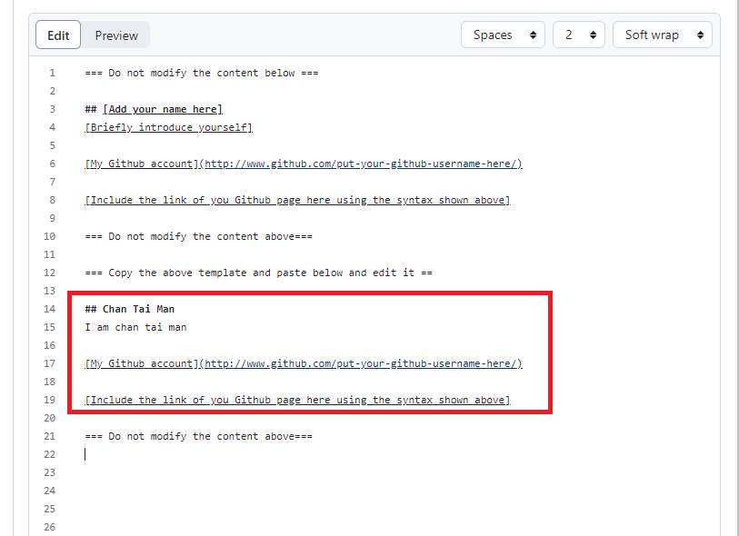
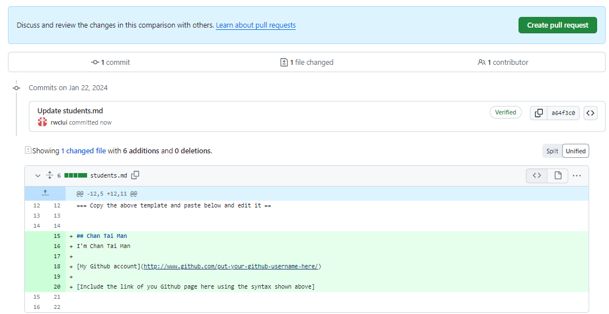
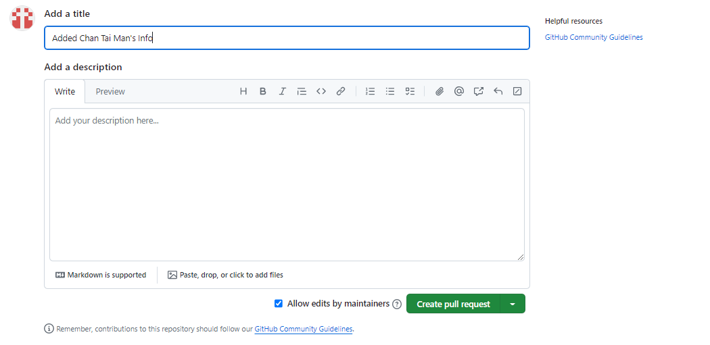

# Collaborative Editing in Github
In this exercise, we will learn how to collaborate edit a file in Github. You should first fork this repository to your own account. Then, edit the file `students.md` and add your name and introduction below the template. Finally, create a pull request to submit your work for review. The detailed instruction is provided below.

# Instructions
1. Fork this repository to your own account. 
    - Click  the `Fork` button on the top right corner of this page. 
    - After forking, you should see a new repository in your account with the same name as this repository.
2. In your forked repository, edit the file `students.md`. 
    
    - Copy and paste the template text and add your name and introduction below the template. 
    - Commit your changes by clicking the `Commit changes` button at the bottom of the page. 
3. Create Pull Request
      
   

    - In Github, pull request is used to submit your work for review before merging to the main branch. 
    -  Create a pull request by clicking the `New pull request` button in the `Pull requests` tab in your repository. 
    - Select this repository as the base repository and your repository as the head repository. Choose the `main` branch. 
    - In the pull request page, add a title and description for your pull request. Then click `Create pull request` button.
  
4. Review your submitted pull request under the `Pull requests` tab in this repository. 

